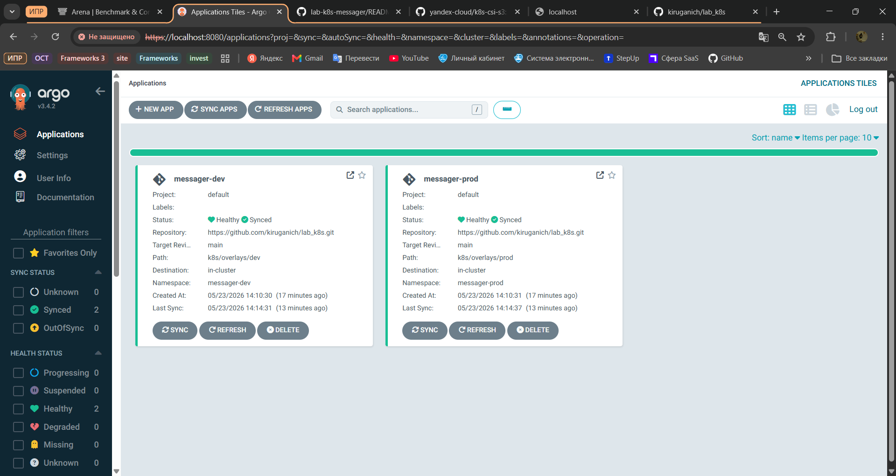
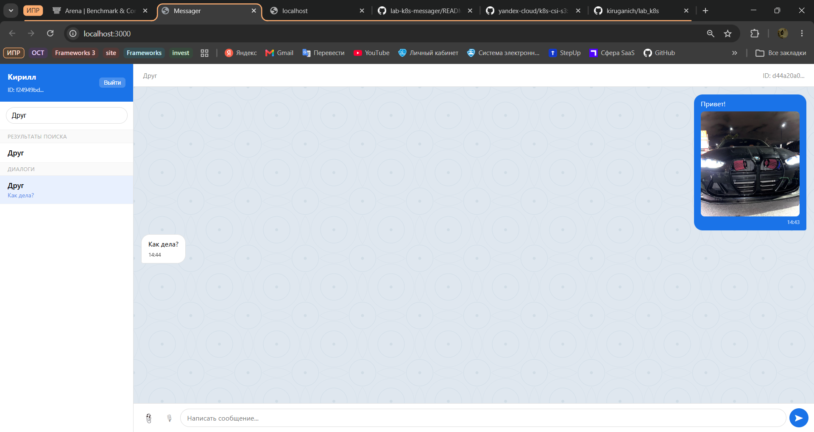

# Отчет

## 1. Цель работы
Развернуть микросервисное приложение (Frontend, BFF, User-Service, Message-Service, Postgres, Minio) в Kubernetes, используя:
- S3 CSI для хранилища файлов.
- Правила `nodeAffinity` для распределения нагрузки.
- Kustomize для разделения конфигураций на `dev` и `prod`.
- ArgoCD для реализации GitOps-подхода.

## 2. Разделение сред (Kustomize)
С помощью Kustomize была реализована гибкая шаблонизация:
* **Base:** Содержит базовые ресурсы (Deployments, Services, ConfigMaps).
* **Dev:** 1 реплика сервисов, минимальные requests/limits. 
* **Prod:** 2 реплики для отказоустойчивости, повышенные лимиты ресурсов, использование `namePrefix: prod-`.

**Вывод `kubectl get pods -n messager-prod` (демонстрация 2 реплик):**
```text
NAME                                    READY   STATUS      RESTARTS      AGE
prod-bff-9dfd674cb-m6zms                1/1     Running     0             58m
prod-bff-9dfd674cb-nrj28                1/1     Running     0             58m
prod-frontend-6689d975cc-5s6bz          1/1     Running     0             58m
prod-frontend-6689d975cc-w7dct          1/1     Running     0             58m
prod-message-service-55bf8ccddf-242kj   1/1     Running     0             58m
prod-message-service-55bf8ccddf-vz6hn   1/1     Running     0             58m
prod-migrate-messages-mqhvg             0/1     Completed   1             58m
prod-migrate-users-ppjsf                0/1     Completed   1             58m
prod-minio-66cfb67dc6-zlvcs             1/1     Running     0             58m
prod-minio-setup-6rvrw                  0/1     Completed   0             58m
prod-postgres-cc99678d9-jszfd           1/1     Running     0             58m
prod-user-service-85598dc95d-4w7rw      1/1     Running     0             58m
prod-user-service-85598dc95d-c5xtm      1/1     Running     2 (57m ago)   58m

```

## 3. Настройка Node Affinity
Базы данных (Postgres, Minio) и миграции были привязаны к инфраструктурным узлам (`workload=system`), а прикладные сервисы — к `workload=app`. Для `message-service` добавлено мягкое предпочтение узлов с SSD (`disk=fast`).

Фрагмент `k8s/base/message-service.yaml`:
```yaml
      affinity:
        nodeAffinity:
          requiredDuringSchedulingIgnoredDuringExecution:
            nodeSelectorTerms:
            - matchExpressions:
              - key: workload
                operator: In
                values:
                - app
          preferredDuringSchedulingIgnoredDuringExecution:
          - weight: 100
            preference:
              matchExpressions:
              - key: disk
                operator: In
                values:
                - fast
```

**Вывод `kubectl get pods -n messager-dev -o wide` (демонстрация распределения по узлам):**
```text
NAME                              READY   STATUS      RESTARTS      AGE
bff-8448c4899f-zwd2v              1/1     Running     0             57m
frontend-6c4fdffb5d-vn9m5         1/1     Running     0             57m
message-service-c46c65c56-9j22b   1/1     Running     0             57m
migrate-messages-742lp            0/1     Completed   2             57m
migrate-users-ppnzx               0/1     Completed   2             57m
minio-675cd678cd-zljgl            1/1     Running     0             57m
minio-setup-2dnzr                 0/1     Completed   0             57m
postgres-646669c6ff-jn7k4         1/1     Running     0             57m
user-service-85b847b479-fx8sd     1/1     Running     2 (57m ago)   57m
```

## 4. GitOps и ArgoCD
Весь процесс деплоя автоматизирован через ArgoCD. Применена политика `automated` с опциями `prune` и `selfHeal`. 

**Скриншот интерфейса ArgoCD (Healthy & Synced):**


## 5. Доступ к приложению
Фронтенд и API шлюз маршрутизируются через port-forward. 

**Скриншот рабочего интерфейса мессенджера:**


---

## 6. Изображения находятся в [images/](./images/)